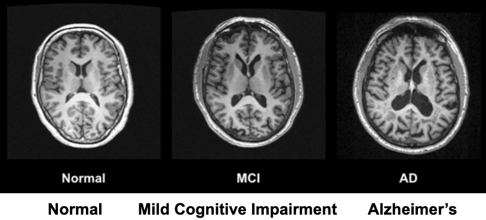
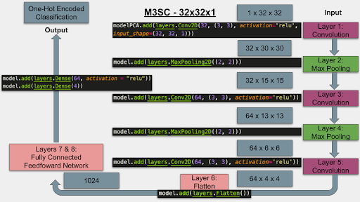
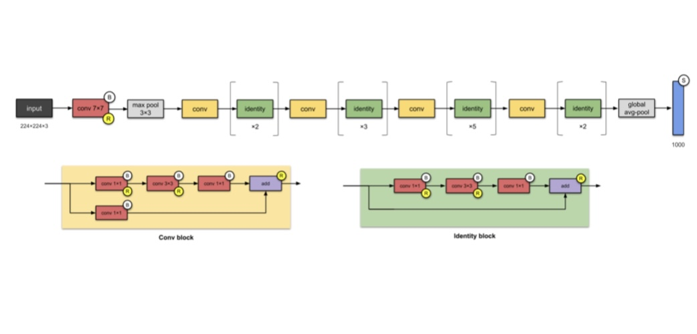
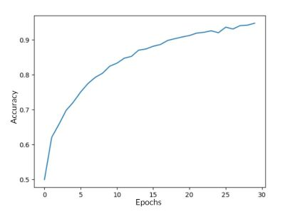
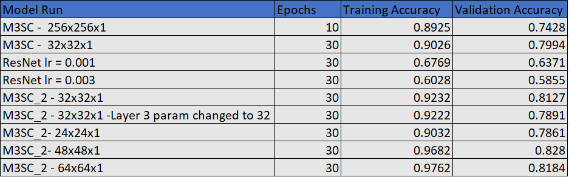

### Introduction

Our project will study MRI scans of human brains to analyze the signs and progression of Alzheimer’s disease. Alzheimer’s Disease is an extremely common disease that affects 5.8 million adults over the age of 65 (Alzheimer's disease 2022). While there is no cure, early treatment is better for managing and reducing symptoms, and MRIs are a tool that can be used to diagnose and evaluate the stage of the disease.

The application of machine learning to the field of neurological and cognitive health is quickly growing. With the possibility of catching diseases like Alzheimer’s years earlier, treatment and prevention could begin much sooner to reduce the progression and clinical onset of the underlying disease. One piece of research we found discussed the prediction of Alzheimer’s progression using machine learning through the analysis of a current trajectory from two MRI scans separated by a known time interval (Mofrad et al., 2021).

Our data set is a collection of 6,400 MRI scans augmented to over 40,000 training and validation images with classifications of the current state of Alzheimer’s disease in each image. The images are labeled to belong to one of four of the following classes: non-demented, mild demented, moderate demented, and very demented. 

Here is a link to our [data set](https://www.kaggle.com/datasets/uraninjo/augmented-alzheimer-mri-dataset)

### Problem Definition

Our project aims to potentially identify regional, morphological abnormalities in individuals with Alzheimer's Disease. These abnormalities display themselves as atrophy in various brain regions, including the hippocampus and entorhinal cortex (Chandra et al., 2018). We also intend to increase diagnostic accuracy, which can either be integrated with patient history or serve as a proactive measure for individuals not yet showing symptoms of the disease. In turn, patient support can increase, and measures to improve patient prognosis may be implemented. Future clinical trials may also be supported to administer potential treatments, mitigate Alzheimer's Disease progression, and enhance patient quality of life.

### Data Collection/Preprocessing

The categorized dataset of over 40,000 augmented MRIs consists of equally sized, 3-channel image files that are generally uniform. The first modification we made was the conversion of the images from color to grayscale. We noticed different MRI images had varying hues appearing as slightly blue, green, or pink. However, these colors introduced randomness that was not indicative of the image classifications. Turning all of our images into grayscale created more consistency among them, and it allowed us to only work with a 1-channel 256 x 256 matrix for each image, as opposed to a 256 x 256 x 3 input. Due to this general uniformity, we believe the versatility of a model trained on this dataset would contribute to the usability of our project in a real-world situation. 
 
After seeing the overfitting problem as well as the complexity of our model by passing the images into the CNN without doing any dimensionality reduction, we applied PCA to a portion of our data and reran the model. This was able to decrease the complexity and running time of the model significantly. To do this we flattened the array of each image from 256 x 256 to 1 x 65,536. We passed the flattened images into the PCA model and reduced the number of dimensions to 1024. We reformatted the data into 32 x 32 arrays and trained a new CNN model, which accounted for the new dimensions.
 
Another way that we attempted to preprocess the data was by resizing the images. We wanted to do this to try and improve accuracy and help the model train faster. We used PIL module to resize the images in a way that did not crop the images but used fewer pixels to cover the images. When comparing trial runs of the CNN models we created using the images after PCA vs using the images after resizing them we found that both dramatically reduced the training time, but the runs with the resized images always yielded higher accuracy. Since the model produced higher accuracy with the resized images, we decided to use the resized images in our final model.

### Methods

In order to analyze the signs and progression of Alzheimer’s disease, we will use a convolutional neural network (CNN). In general, deep learning models outperform statistical machine learning methods in image processing tasks, and CNNs are particularly distinguished among other types of neural networks. Moreover, image processing with CNNs has already proven an effective and efficient tool in disease detection, so there is an abundance of literature to draw upon (Khagi et al., 2019).
 
We discovered it is easy to create a model that is too complex or takes too large of an input and, therefore, is extremely expensive in computation. With only eight layers in our simple CNN, we still had over 121,000 trainable parameters. To mitigate this issue, we implemented principal component analysis (PCA) on our input data.

### Results and Discussion

We built our initial model using the TensorFlow model because of the plethora of documentation on image CNNs in tensorflow. The architecture for the initial model that we created named the M3SC is detailed in Figure 1 below. We created a model that takes in the image size and one color channel and uses 3 convolution layers and 2 max pooling layers to classify the images into one of the four labels: non-demented, mild demented, moderate-demented, and very demented.

For our initial model(M3SC 256x256x1), we used the M3SC architecture that we created similar to the one in Figure except the input was the full image size of 256x256x1 instead of the resized 32x32x1 images. We ran this model with the full set of grayscale images, we got an initial accuracy of around 89.71% through 10 epochs of 450 steps in a total of 2.52 hours. While this was quite good, we noticed that during validation, our accuracy was only 74.85%, meaning that there was a significant amount of overfitting happening. In the next models, we sought to address the overfitting issue and lower the amount of 

*Figure 1*

Our next iteration was using the M3SC with the resized images, down from 256x256x1 to 32x32x1. This led to much faster running, only taking around ___ minutes to complete which let us run 30 epochs instead of just 10 epochs like we did using original runs of M3SC. It also improved our accuracy to 90.26% with a validation accuracy of 79.94% also reducing the overfitting. 

After that, we wanted to try using a totally different architecture, namely ResNet50, to see how it compared to our M3SC architecture. Unfortunately, this architecture wasn’t as powerful as we were hoping, achieving a training accuracy of 67.69% and 60.28% with a learning rate of 0.001 and 0.003, respectively, alongside a validation accuracy 63.71% and 58.55%, respectively. One of the reasons that we are thinking the ResNet50 struggled with our dataset is because our images were in grayscale and the ResNet50 was created based on color images. In order to apply our images to the architecture we had to simulate 3 color channels by stacking the images. 

*Figure 2*

The last architecture was the M3SC_2 which was a modification on the M3SC architecture with Layer 4 and Layer 5 removed. Simplifying the model improved the accuracy of the run with the resize 32x32x1 images to a training accuracy of 92.32% and validation accuracy of 81.27%. We also tried to reduce the complexity of M3SC_2 by changing reducing the number of parameters from 64 to 32 in layer 3, but it lead to worse results that the previous modification, with training accuracy 92.22% and validation accuracy 78.91%. 

From here, we worked on fine-tuning the hyperparameters, namely, the size we resize the images into. We looked at 24x24x1, 48x48x1, and 64x64x1. These sizes led to training accuracy of 90.32%, 96.82%, and 97.62% respectively, and validation accuracy of 78.61%, 82.20%, and 81.84% respectively.

The model with the highest training and validation accuracy was the M3SC_2 64x64x1 which had a training accuracy of 97.62% and a validation accuracy of 81.8%. However, this model was overfitting more than M3SC_2 32x32x1 without much improvement in accuracy, so this model may be better to work with. With this model the accuracy was leveling off around 30 Epochs and the best way to work to improve the slight overfitting model from here would be to add more data to the model, which is what we would suggest for the future.

*Figure 3*

Overall, we were satisfied with the results of our model, as it accurately categorized the images into the four classes about 80% of the time. This model distinguishes the images between the classes more accurately than humans. With more data, this model could be helpful in diagnosing patients with earlier stages of Alzheimer’s Disease in the process to help them to start treatment earlier.

*Table 1*

### Gantt Chart and Contribution Table

Here is a link to our [Gantt Chart](https://gtvault-my.sharepoint.com/:x:/g/personal/scanastra3_gatech_edu/EV418BSlG0dIvm-2YcQRGKwB812RjocrHM2qpRjKDK-q9A?e=HlPncl)

Here is a link to our [Contribution Table](https://gtvault-my.sharepoint.com/:x:/g/personal/scanastra3_gatech_edu/EfC08hdEY7VAvQ7QMMIQ2TABL5AW9ueuiT-u4cN8wCn8bg?e=FmujgV)

### References

* Chandra, A., Dervenoulas, G., & Politis, M. (2018). Magnetic Resonance Imaging in alzheimer’s disease and mild cognitive impairment. Journal of Neurology, 266(6), 1293–1302. https://doi.org/10.1007/s00415-018-9016-3
* Khagi, B., Kwon, G. R., & Lama, R. (2019). Comparative analysis of alzheimer's disease classification by CDR level using CNN, Feature Selection, and machine‐learning techniques. International Journal of Imaging Systems and Technology, 29(3), 297–310. https://doi.org/10.1002/ima.22316
* Mayo Foundation for Medical Education and Research. (2022, February 19). Alzheimer's disease. Mayo Clinic. Retrieved October 6, 2022, from https://www.mayoclinic.org/diseases-conditions/alzheimers-disease/symptoms-causes/syc-20350447?utm_source=Google&utm_medium=abstract&utm_content=Alzheimers-disease&utm_campaign=Knowledge-panel
* Mofrad, S. A., Lundervold, A. J., Vik, A., & Lundervold, A. S. (2021). Cognitive and MRI trajectories for prediction of alzheimer’s disease. Scientific Reports, 11(1). https://doi.org/10.1038/s41598-020-78095-

